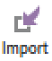
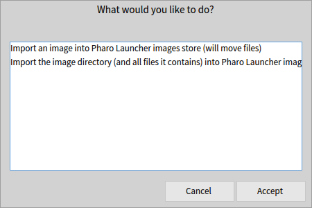
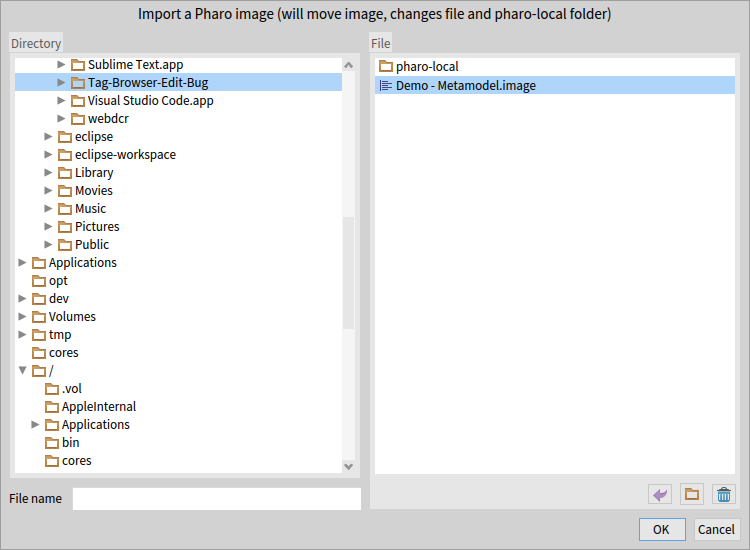
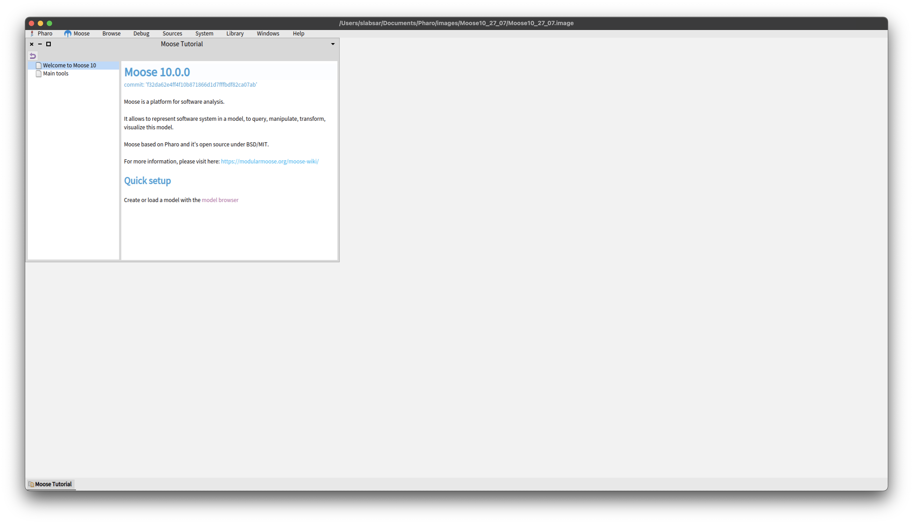
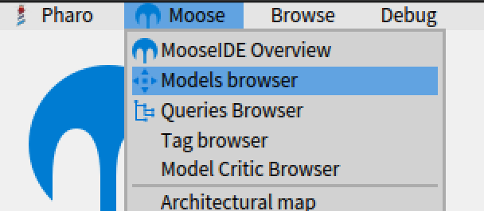
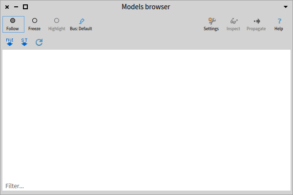
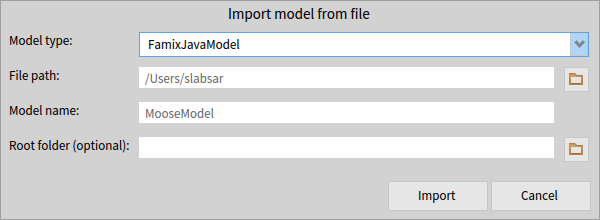

# Moose

Dans ce fichier, vous trouverez les différentes étapes à suivre pour (1) lancer une image Moose  et (2) charger votre modèle.

## 1. Lancer une image Moose

Dans un premier temps, télécharger et installer le pharo launcher en suivant les étapes décrites sur cette page : [Downloading Pharo Launcher](https://pharo-project.github.io/pharo-launcher/installation/).

Une fois le pharo launcher lancé, suivre ces étapes pour exécuter une image Moose :
1. Cliquer sur le bouton **Import**  et séléctionner la première option.   
2. Sélectionner l'image (fichier avec extension *.image*) sur le disque.   
3. Séléctionner l'image dans la liste et cliquer sur le bouton **Launch** .
4. L'image Moose est lancée.   

## 2. Charger le modèle

Dans une image Moose ouverte, suivre les étapes suivantes afin de charger un modèle : 

1. Ouvrir le **Models browser** à partir du menu; **Moose** > **Models browser**  
2. Dans le Models browser cliquer sur le bouton **File**  pour importer le fichier contenant le modèle.   
3. Dans la fenêtre d'import, choisir le type de modèle (**FamixCppModel** pour un modèle C++) dans la liste déroulante du champs **Model type**.    
4. Choisir le chemin vers le fichier contenant le modèle (avec extension .mse, .ref ou .json) à l'aide du champs **File path**.
5. (Étape optionnelle) Il est possible de lier le modèle avec le code source pour pouvoir utiliser les outils qui nécessitent le code source. Pour cela, choisir le dossier raçine du projet dans le champs **Root folder**.
6. Cliquer sur le bouton **Import**. L'importation peut prendre plusieurs minutes.

## Conseils

- Sauvegarder régulièrement l'image Moose quand c'est nécessaire, afin de ne pas perdre les changements en cas de disfonctionnement de la machine ou de l'image.
- La fonction "Freeze" permet de ne pas écraser l'état d'un browser après la propagation d'entités à partir d'un autre browser. Àprès l'ouverture d'un browser, il est conseillé de le "Freeze", après lui avoir propagé les entités qui l'intéressent.